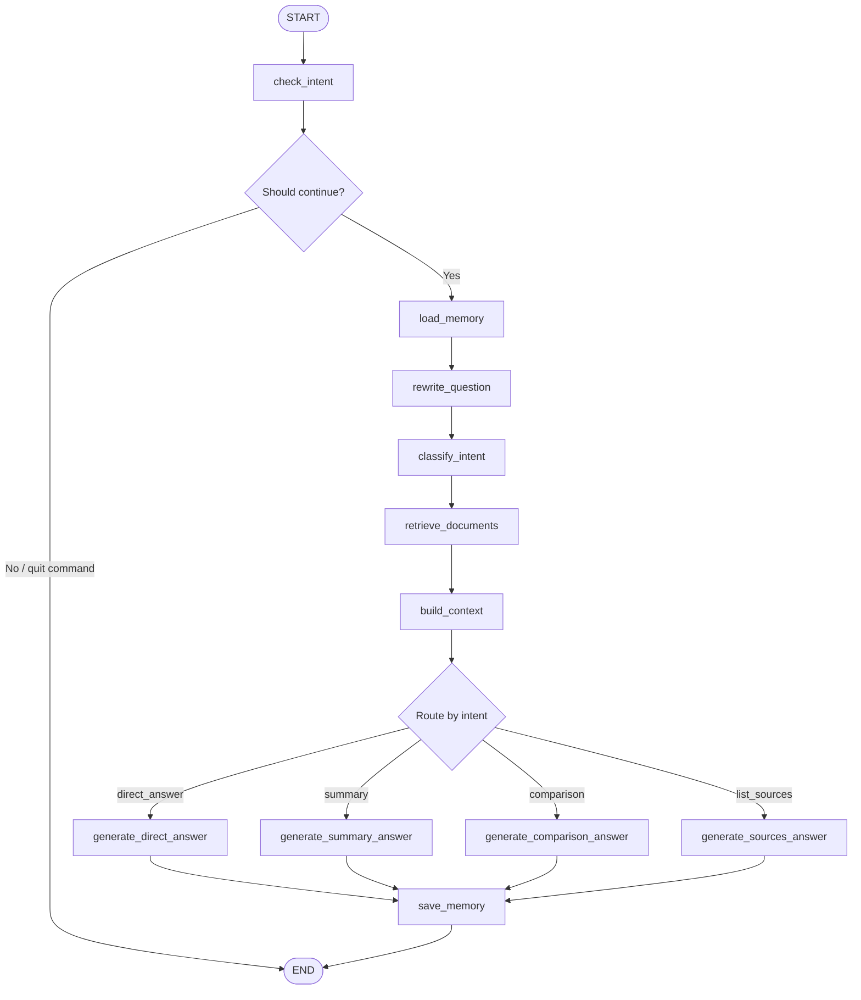

cat > README.md <<'EOF'
# ResearchGraph RAG

A LangGraph-powered research paper assistant that allows users to query, summarise, compare, and retrieve sources from a local collection of PDF research papers.

The system ingests PDFs, chunks the text, creates OpenAI embeddings, stores them in a Chroma vector database, and uses a LangGraph workflow to answer research questions with source-grounded responses.

## Features

- PDF ingestion from a local `data/` folder
- Text chunking for better retrieval
- OpenAI embedding generation
- Persistent Chroma vector database
- LangGraph-based agent workflow
- Conditional quit routing
- Persistent local memory using `memory.json`
- Memory-aware question rewriting for follow-up questions
- Intent classification:
  - direct answer
  - paper/topic summary
  - comparison
  - source listing
- Ranked source retrieval with relevance scores
- Source-grounded answers using retrieved paper chunks

## Project Structure

```text
paper_embedder/
│
├── data/                       # Local PDFs, not committed
├── vector_db/                  # Local Chroma DB, not committed
├── ingest.py                   # Ingests PDFs into Chroma
├── graph_agent.py              # LangGraph agent logic
├── main.py                     # Main project launcher
├── query.py                    # Simple baseline RAG query script
├── memory.json                 # Local memory, not committed
├── research_agent_graph.mmd    # Mermaid graph of the agent workflow
├── requirements.txt
├── .env.example
├── .gitignore
└── README.md
```

## Agent Workflow



## How It Works

1. Add research papers to the `data/` folder.
2. Run `ingest.py` to load, split, embed, and store PDF chunks in Chroma.
3. Run `main.py` to start the LangGraph research assistant.
4. Ask natural-language questions about the uploaded papers.
5. The assistant rewrites follow-up questions, classifies the request type, retrieves relevant chunks, and generates a grounded answer with sources.

## Installation

Create and activate a Python environment:

```bash
conda create -n research_agent python=3.11
conda activate research_agent
```

Install dependencies:

```bash
pip install -r requirements.txt
```

Create your environment file:

```bash
cp .env.example .env
```

Then add your OpenAI API key inside `.env`:

```env
OPENAI_API_KEY=your_openai_api_key_here
```

## Usage

Add your PDFs inside:

```text
data/
```

Then ingest the papers:

```bash
python ingest.py
```

Start the assistant:

```bash
python main.py
```

Example questions:

```text
Summarise the CNN-based radar cube paper.
```

```text
Compare the radar cube method with point-cloud methods.
```

```text
Which sources mention classification results?
```

```text
Explain the previous answer more simply.
```

To quit:

```text
quit
```

## Technologies Used

- Python
- LangGraph
- LangChain
- OpenAI API
- ChromaDB
- PyPDF
- dotenv
- Mermaid

## Why This Project Matters

Researchers often collect many PDFs but struggle to search, compare, and extract useful information from them efficiently. This project demonstrates how an agentic RAG workflow can turn a local research library into an interactive assistant that supports question answering, summarisation, comparison, source retrieval, and conversational follow-up.

## Notes

This repository does not include uploaded PDFs, vector database files, API keys, or local memory files. These are intentionally excluded using `.gitignore`.
EOF